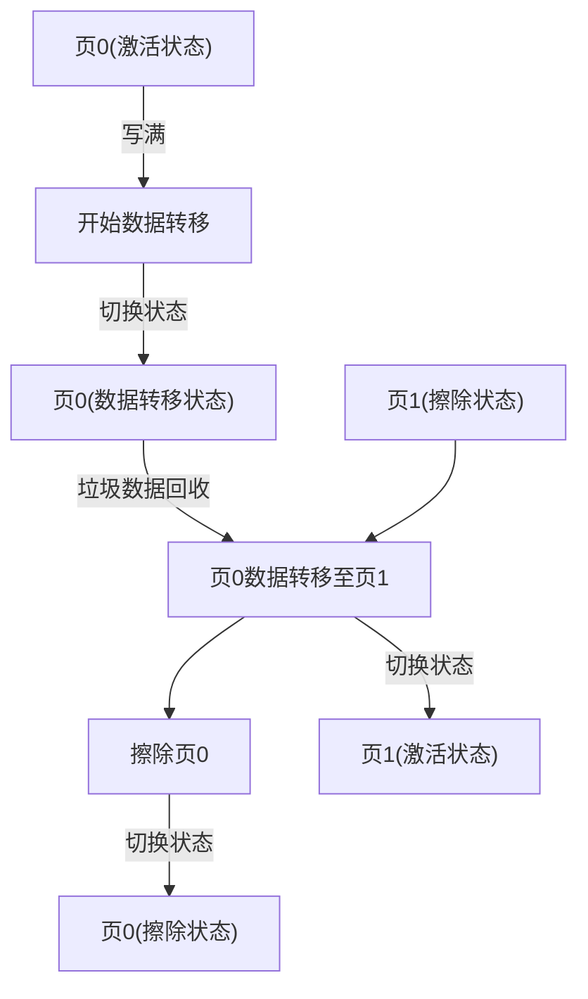

FLASH和EEPROM都为非易失性存储器，它们在断电后都可以保存数据。

当使用FLASH去模拟EEPROM时，我们需要修改数据的存储结构，在FLASH中数据会以如下结构存储：

|数据|地址|
|---|---|
|16 bit|16 bit|

用一个32 bit的FLASH存储单元去记录一个EEPROM的16 bit数据以及该数据所在的EEPROM地址。

在实际使用中，我们通常会用到两页长度相同的FLASH空间（每个页可以由多个扇区组成）。

这两个页有三种状态：激活状态，擦除状态和数据转移状态。（我们会使用到每个页页首地址的一个32位存储单元记录当前页的状态）

为什么要使用到两个页？因为这会实现FLASH模拟EEPROM的一个重要机制——垃圾回收机制。

首先要注意的是，我们写入FLASH的EEPROM数据是数据+地址形式的，这意味着我们写入或更新EEPROM数据时，可以不用按照地址顺序，也可以不擦除FLASH，而是直接在激活页后追加，这样相当于用新数据去覆盖旧数据。

因为越靠后的数据越新，所以在需要读取EEPROM的数据时，我们应该从后往前读，并跳过地址重复的旧数据。

使用这种方法写或更新EEPROM容易产生冗余数据，当数据将激活页填满时，激活页就会进入数据转移状态，回收垃圾数据并转移精简后的数据到擦除页，之后擦除激活页，最后激活页与擦除页的状态互相转化。

这三种状态转换关系如下：

